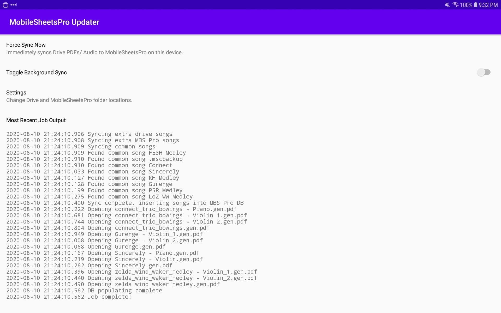

# MobileSheetsPro Updater

Android application that reads audio/ PDF files from Google Drive and adds them for use with [MobileSheetsPro](https://www.zubersoft.com/mobilesheets/).

## Setup

Android Studio should do all the necessary setup for the code itself. However, you may need to create a new Android OAuth client ID on your Google API console.

## Notes

### Play Store

I haven't put in the time to polish this application (especially having Google verify the app for the Drive APIs it needs) and put it on the Play Store. To run on my personal device I've been generating a release APK in Android studio and installing it manually.

### Manual MobileSheetsPro Entries

For simplicity, the updater clears the MBS Pro database every time it runs, which makes using the updater with manual MBS Pro songs impossible. Support for not clearing existing MBS Pro songs not managed by the updater is planned to be done some time in the future.